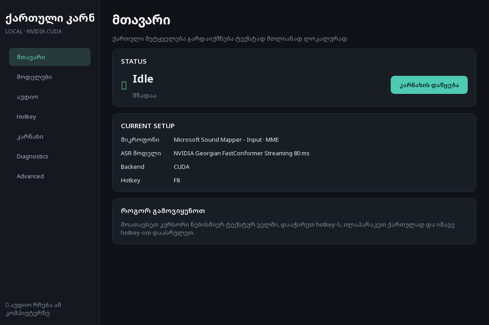
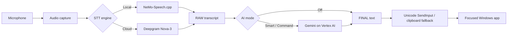

# Georgian Dictation

Open-source **Windows 11 dictation for Georgian** with local speech recognition, optional cloud ASR, and an optional AI post-processing layer.

The project is built for a practical gap: Georgian speakers have far fewer high-quality desktop dictation options than users of high-resource languages. Georgian Dictation aims to provide a transparent, extensible Windows foundation for voice input that can work locally, use cloud recognition when desired, and preserve the raw transcript when AI processing fails.



> **Status:** beta / active development. The application is Windows-specific and currently targets Python 3.12.

## Why this project exists

Georgian (`ka`) is a comparatively low-resource language in speech tooling. This project focuses on a desktop workflow that is useful in real applications—not only a transcription demo. It captures microphone audio, performs speech recognition, optionally corrects the resulting text, and inserts Georgian Unicode text into the currently focused Windows application.

The design priorities are:

- **Georgian-first UX** and Unicode-safe text insertion.
- **Local-first operation** when an NVIDIA/NeMo model is selected.
- **Explicit cloud boundaries** when Deepgram or Vertex AI is enabled.
- **No telemetry in the application.**
- **Credentials kept out of source and settings files.**
- **Raw transcript preservation** if optional AI processing fails.
- **Provider separation:** STT, AI post-processing, insertion, UI, and model management are independent layers.

## Features

| Area | Current implementation |
| --- | --- |
| Local STT | NVIDIA Georgian FastConformer through NeMo-Speech.cpp |
| Cloud STT | Deepgram Nova-3 with `language=ka` |
| AI processing | Optional Smart Correction and AI Command modes through Gemini on Vertex AI |
| Credential storage | Deepgram key in Windows Credential Manager; Google auth through ADC |
| Dictation modes | Toggle and push-to-talk global hotkeys |
| Text insertion | Windows Unicode `SendInput` with clipboard fallback |
| Long dictation | Ordered phrase queue with adaptive energy/VAD segmentation |
| Diagnostics | Same-WAV model comparison, latency/RTF, optional WER |
| UX | Qt desktop UI, tray behavior, focus-safe overlay |

## Privacy model

The application does not include telemetry.

- **Local NVIDIA modes:** microphone audio remains local to the machine.
- **Deepgram mode:** microphone/WAV audio is sent to Deepgram only while that engine is selected.
- **Vertex AI processing:** only completed text transcripts are sent; audio is not sent to Vertex AI.
- **Plain / Off mode:** Gemini is not called.
- **Deepgram credentials:** stored through the current Windows user's Credential Manager.
- **Google credentials:** discovered through Application Default Credentials (ADC); the app does not read or bundle a service-account JSON file.

See [docs/PRIVACY.md](docs/PRIVACY.md) for the data-flow details.

## Requirements

- Windows 11 x64
- Python 3.12 for source/development builds
- A compatible microphone
- For local NVIDIA recognition: a compatible NeMo-Speech.cpp runtime and Georgian model
- For CUDA acceleration: a compatible NVIDIA GPU/driver
- For Deepgram: your own Deepgram API key
- For Vertex AI processing: Google Cloud CLI, ADC, an enabled Vertex AI API, and appropriate IAM access

External speech models, cloud credentials, and native NeMo runtime binaries are **not** committed to this repository.

## Run from source

```powershell
python -m venv .venv
.\.venv\Scripts\python.exe -m pip install -r requirements-dev.txt
.\.venv\Scripts\pythonw.exe run_app.pyw
```

The application can also be launched after installation through the console entry point:

```powershell
georgian-dictation
```

## Configure local NVIDIA models

The default model directory is:

```text
%USERPROFILE%\NemoSpeechModels
```

The current registry contains:

- **FAST / LIVE** — `nvidia/stt_ka_fastconformer_hybrid_transducer_ctc_large_streaming_80ms_pc`
- **ACCURATE** — `nvidia/stt_ka_fastconformer_hybrid_large_pc`

The application does not redistribute those model files. The Accurate workflow can download/use the external converter expected by the project and generate a local BF16 GGUF.

## Configure Deepgram

Select **Deepgram Nova-3 Georgian** and save your API key from the Advanced page. The key is stored in Windows Credential Manager and is not written to `settings.json` or source files.

The recognizer pins the Georgian configuration, including `model=nova-3` and `language=ka`.

## Configure Gemini on Vertex AI

The public repository intentionally contains **no maintainer-specific Google Cloud project ID**.

Authenticate ADC:

```powershell
gcloud auth application-default login
```

Then either let Google ADC expose a project/quota project, or explicitly configure the project for Georgian Dictation:

```powershell
$env:GEORGIAN_DICTATION_VERTEX_PROJECT="YOUR_PROJECT_ID"
```

Optional location override:

```powershell
$env:GEORGIAN_DICTATION_VERTEX_LOCATION="global"
```

For a persistent Windows user environment variable, use `setx` instead of the current-session PowerShell assignment.

The AI pipeline is:

```text
selected STT -> RAW transcript -> optional Gemini -> FINAL text -> active Windows field
```

**Smart Correction** is intentionally conservative. The processor protects numbers, dates, URLs, and email-like tokens and falls back to the raw transcript if protected values change.

**AI Command** accepts a natural-language instruction in Georgian, Russian, or English and returns only the text intended for insertion.

## Tests

Run the unit suite:

```powershell
.\.venv\Scripts\python.exe -m pytest
```

Optional Windows integration checks:

```powershell
.\.venv\Scripts\python.exe .\tools\test_text_insertion.py
.\.venv\Scripts\python.exe .\tools\test_notepad_insertion.py
.\.venv\Scripts\python.exe .\tools\test_overlay_focus.py
```

The NeMo CUDA smoke test automatically skips when the local Georgian model is absent.

## Build the Windows executable

```powershell
.\build.ps1 -Clean
```

Expected output:

```text
dist\GeorgianDictation\GeorgianDictation.exe
```

Build outputs and local runtime artifacts are intentionally ignored by Git.

## Architecture



A module-level description is available in [docs/ARCHITECTURE.md](docs/ARCHITECTURE.md).

## Repository layout

```text
georgian_dictation/
  ai/           Vertex Gemini client, prompts, correction/command processing
  asr/          STT abstraction, Deepgram, NeMo native wrapper/runtime checks
  audio/        microphone capture
  config/       settings and Windows credential storage
  hotkeys/      global toggle / push-to-talk handling
  insertion/    Unicode SendInput and clipboard fallback
  models/       model registry and installer logic
  services/     dictation, diagnostics, startup/background tasks
  ui/           Qt UI and focus-safe overlay
tests/          unit and optional native integration tests
tools/          Windows development / integration utilities
docs/           architecture and privacy documentation
```

## Contributing

Issues and pull requests are welcome. Start with [CONTRIBUTING.md](CONTRIBUTING.md). Please do not include API keys, ADC files, personal logs, model binaries, or local build artifacts in issues or commits.

## Security

Please use the repository's private vulnerability reporting flow when available rather than opening a public issue for a security problem. See [SECURITY.md](SECURITY.md).

## Roadmap

See [ROADMAP.md](ROADMAP.md). Near-term goals include a cleaner first-run setup, broader test coverage, reproducible releases, clearer provider configuration, and continued Georgian accuracy/UX work.

## ქართული მოკლე აღწერა

**Georgian Dictation / ქართული კარნახი** არის Windows 11-ის ღია კოდის აპი ქართული ხმოვანი კარნახისთვის. შესაძლებელია ლოკალური NVIDIA/NeMo ამოცნობა, სურვილისამებრ Deepgram Nova-3 და ტექსტის დამატებითი Gemini/Vertex AI დამუშავება. Cloud ფუნქციები არჩევითია, credentials source-ში არ ინახება, ხოლო AI შეცდომის შემთხვევაში RAW transcript არ იკარგება.

## License

MIT. See [LICENSE](LICENSE).

Third-party services, model names, and trademarks belong to their respective owners. This repository does not bundle third-party cloud credentials or proprietary model weights.
